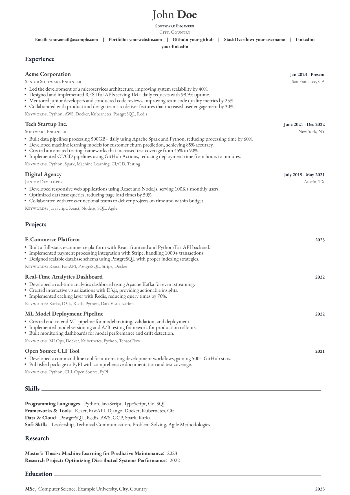

# PyResume

**Generate professional PDF resumes from YAML data using LaTeX templates.**

PyResume combines the simplicity of YAML configuration with the typographic excellence of LaTeX to produce stunning resumes. Define your content once, generate consistently formatted PDFs with a single command.


---

## Preview

<p align="center">
  
</p>

---

## Features

- **YAML-based content** — Define your resume in clean, readable YAML files
- **Professional templates** — Uses the stunning [Awesome CV](https://github.com/posquit0/Awesome-CV) LaTeX template
- **Flexible section ordering** — Control the order of resume sections via configuration
- **Modular data structure** — Separate files for each section (personal, experience, education, etc.)
- **Single command build** — Generate your PDF with `make build`
- **Pure Python** — Minimal dependencies, easy to customize

---

## Prerequisites

- **Python 3.11+**
- **[Tectonic](https://tectonic-typesetting.github.io/en-US/)** — Modern LaTeX engine

### Installing Tectonic

**Ubuntu/Debian:**
```bash
sudo apt install tectonic
```

**macOS:**
```bash
brew install tectonic
```

**Other systems:** See the [Tectonic installation guide](https://tectonic-typesetting.github.io/en-US/install.html)

---

## Quick Start

### 1. Clone the repository

```bash
git clone https://github.com/your-username/PyResume.git
cd PyResume
```

### 2. Set up the environment

```bash
make setup
```

Or manually:

```bash
python3 -m venv .venv
source .venv/bin/activate
pip install -r requirements.txt
```

### 3. Customize your resume

Edit the YAML files in the `data/` directory:

- `personal.yaml` — Your name, contact info, and links
- `experience.yaml` — Work experience
- `education.yaml` — Education history
- `skills.yaml` — Technical and soft skills
- `projects.yaml` — Notable projects
- `research.yaml` — Research and publications
- `config.yaml` — Theme and section order

### 4. Generate your PDF

```bash
make build
```

Your resume will be generated at `output/resume.pdf`.

---

## Project Structure

```
PyResume/
├── Makefile               # Build automation
├── README.md              # This file
├── FORMATTING.md          # YAML formatting guide
├── requirements.txt       # Python dependencies
│
├── data/                  # Resume content (YAML)
│   ├── config.yaml        # Configuration & section order
│   ├── personal.yaml      # Personal information
│   ├── experience.yaml    # Work experience
│   ├── education.yaml     # Education
│   ├── skills.yaml        # Skills
│   ├── projects.yaml      # Projects
│   └── research.yaml      # Research & publications
│
├── scripts/               # Python scripts
│   └── generate_resume.py # Main generator script
│
├── templates/             # LaTeX templates
│   └── awesome-cv.tex     # Awesome CV template
│
├── assets/                # LaTeX assets
│   ├── awesome-cv.cls     # Awesome CV class file
│   └── fonts/             # Custom fonts
│
└── output/                # Generated files
    ├── resume.tex         # Generated LaTeX (debug)
    └── resume.pdf         # Final PDF output
```

---

## YAML Format

### Configuration (`config.yaml`)

```yaml
theme: "awesome-darknight"    # Color theme
font_size: "10pt"             # Font size
section_order:                # Order of sections in PDF
  - experience
  - skills
  - education
  - projects
  - research
```

### Personal Information (`personal.yaml`)

```yaml
first_name: John
last_name: Doe
position: "Software Engineer"
address: "San Francisco, CA"
email: "john.doe@example.com"
homepage: "johndoe.dev"
linkedin: "johndoe"
github: "johndoe"
stackoverflow:
  id: "12345678"
  name: "johndoe"
```

### Experience (`experience.yaml`)

```yaml
- company: Acme Corporation
  position: Senior Software Engineer
  location: San Francisco, CA
  dates: Jan 2023 - Present
  details:
    - Led development of microservices architecture, improving scalability by 40%.
    - Designed RESTful APIs serving 1M+ daily requests.
  keywords: Python, AWS, Docker, Kubernetes
```

### Skills (`skills.yaml`)

```yaml
- category: Programming Languages
  items: Python, JavaScript, Go, SQL

- category: Frameworks & Tools
  items: Django, React, Docker, Kubernetes
```

See `FORMATTING.md` for the complete formatting guide.

---

## Customization

### Available Themes

The Awesome CV template supports these color themes:

- `awesome` (default orange)
- `awesome-emerald`
- `awesome-skyblue`
- `awesome-red`
- `awesome-pink`
- `awesome-orange`
- `awesome-nephritis`
- `awesome-concrete`
- `awesome-darknight`

Set your preferred theme in `config.yaml`.

### Creating Custom Templates

1. Create a new `.tex` file in `templates/`
2. Use Jinja2 syntax with custom delimiters:
   - Variables: `\VAR{variable_name}`
   - Blocks: `\BLOCK{if condition}...\BLOCK{endif}`
   - Loops: `\BLOCK{for item in items}...\BLOCK{endfor}`

3. Generate with:
   ```bash
   python scripts/generate_resume.py --template your-template.tex
   ```

---

## CLI Options

```bash
python scripts/generate_resume.py [OPTIONS]
```

| Option | Description | Default |
|--------|-------------|---------|
| `--yaml` | Path to data directory | `data/` |
| `--template` | Template filename | `awesome-cv.tex` |
| `--output` | Output filename (without extension) | `resume` |

---

## Makefile Targets

| Target | Description |
|--------|-------------|
| `make setup` | Create virtual environment and install dependencies |
| `make build` | Generate resume PDF |
| `make clean` | Remove generated files |
| `make help` | Show all available targets |

---

## Troubleshooting

### "Virtual environment not activated"

```bash
source .venv/bin/activate
```

Or use Make targets which handle this automatically.

### "Tectonic not found"

Install Tectonic system-wide (see Prerequisites section).

### LaTeX compilation errors

Check the generated `output/resume.tex` file for syntax errors.

### Section not appearing

Ensure the section name in `section_order` matches the section key in your YAML files exactly.

---

## License

This project uses the [Awesome CV](https://github.com/posquit0/Awesome-CV) LaTeX template by [posquit0](https://github.com/posquit0), licensed under the LaTeX Project Public License.

The Python code in this repository is licensed under the MIT License.

---

## Acknowledgments

- [Awesome CV](https://github.com/posquit0/Awesome-CV) — Beautiful LaTeX template
- [Tectonic](https://tectonic-typesetting.github.io/) — Modern LaTeX engine
- [Jinja2](https://jinja.palletsprojects.com/) — Templating engine

---

## Contributing

Contributions are welcome!
